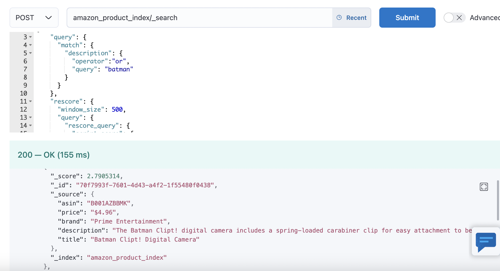

# Personalized Product Search Engine

       Atharva Moroney          Sameer Ahmed         Saksham Garg

                       amm9801                      sa6142                     sg6482

Big Data Application Development

Fall 2022

**Table of Contents**

<table>
  <tr>
   <td><strong>Section</strong>
   </td>
   <td><strong>Title</strong>
   </td>
   <td><strong>Page</strong>
   </td>
  </tr>
  <tr>
   <td>
<ol>

<li>
</li>
</ol>
   </td>
   <td>Introduction 
   </td>
   <td>3
   </td>
  </tr>
  <tr>
   <td>
<ol>

<li>
</li>
</ol>
   </td>
   <td>Problem Statement 
   </td>
   <td>3
   </td>
  </tr>
  <tr>
   <td>
<ol>

<li>
</li>
</ol>
   </td>
   <td>Dataset 
   </td>
   <td>3
   </td>
  </tr>
  <tr>
   <td>
<ol>

<li>
</li>
</ol>
   </td>
   <td>Methodology
   </td>
   <td>4
   </td>
  </tr>
  <tr>
   <td>
<ol>

<li>
</li>
</ol>
   </td>
   <td>Design Diagram 
   </td>
   <td>5
   </td>
  </tr>
  <tr>
   <td>
<ol>

<li>
</li>
</ol>
   </td>
   <td>Challenges and Obstacles 
   </td>
   <td>5
   </td>
  </tr>
  <tr>
   <td>
<ol>

<li>
</li>
</ol>
   </td>
   <td>Results
   </td>
   <td>7
   </td>
  </tr>
  <tr>
   <td>10.
   </td>
   <td>Conclusion 
   </td>
   <td>11
   </td>
  </tr>
  <tr>
   <td>11.
   </td>
   <td>Acknowledgements
   </td>
   <td>11
   </td>
  </tr>
  <tr>
   <td>12.
   </td>
   <td>References
   </td>
   <td>11
   </td>
  </tr>
</table>

## Introduction

On online selling platforms such as Amazon, when users enter a search query, they expect that only the most relevant products to be displayed. With this goal in mind, in this project, we have developed a Product Search Engine. This will be beneficial for customers and sellers alike.

## Problem Statement

Customers usually have a preferred taste and this taste changes rarely. Hence, they are more likely to buy products similar to the ones they already like. Hence, on online selling platforms such as Amazon, the users expect search results to be tailored according to their likes and preferences. Moreover, the sellers can also benefit by providing personalized recommendations because that eases their customers’ lives. This will lead to revenue boost for the sellers. Hence, personalized search engines are beneficial for everyone - customers as well as sellers.

With the above motivation in mind, we have developed a “personalized product search engine”. Whenever a user enters a search query, the engine will return products whose title contains the search query, while also tailoring the search results by taking into account the user’s previous product ratings.

## Dataset

We have used the Amazon Review Data(2018) at https://nijianmo.github.io/amazon/. The complete data is segregated into multiple categories and each category contains 2 JSON files-   review data and metadata. The total number of reviews in the complete dataset is ~233.1 million. However, we have used only a subset of this dataset, primarily the three categories which are listed below -

<table>
  <tr>
   <td><strong>Data Source</strong>
   </td>
   <td><strong>Description</strong>
   </td>
   <td><strong>Format</strong>
   </td>
   <td><strong>Size</strong>
   </td>
  </tr>
  <tr>
   <td>Amazon Review Data for Books
   </td>
   <td>Reviews and corresponding Metadata for Books
   </td>
   <td>JSON
   </td>
   <td>42 GB
   </td>
  </tr>
  <tr>
   <td>Amazon Review Data for Clothing, Shoes and Jewellery
   </td>
   <td>Reviews and corresponding Metadata for Clothing, Shoes and Jewellery
   </td>
   <td>JSON
   </td>
   <td>23 GB
   </td>
  </tr>
  <tr>
   <td>Amazon Review Data for Electronics
   </td>
   <td>Reviews and corresponding Metadata for Electronics
   </td>
   <td>JSON
   </td>
   <td>22 GB
   </td>
  </tr>
</table>

The total size of the dataset is **87 GB**.

## Methodology

First, we perform data cleaning and profiling on the dataset using Spark. We perform the following steps while cleaning data - 

* Filter out users with &lt; 5 number of ratings given. This is because, as we will explain later, we are training an ALS model to find latent factors of user and product profiles.
* Filter out products with too less number of ratings. Products with only a few ratings can cause bias, leading to incorrect results. For instance, if a product has only one rating of 5 stars, that does not necessarily mean that it is a very good product. We look for average ratings of the products.
* Filter out any unverified reviews. Unverified reviews may not be authentic, leading to incorrect results.
* Filter out negative/zero ratings. This data is due to some error as the range of ratings should be 1 - 5. 

We store the cleaned data in HDFS in csv format.

With the data loaded, we build a product to user recommendation model using Alternating Least Squares (ALS) matrix factorization in Apache Spark ML. Such matrix factorization algorithms work by decomposing the interaction matrix into the product of two reduced dimensionality matrices. One representing the latent factors of the products and the other representing the latent factors of the users.

For the purpose of this project, we have used rank as 48, regularization parameter as 0.05, and max iterations as 10 for training the ALS model. The model took ~11 hours to train on the DataProc cluster.

We ingested all the data, along with the latent factors from the ALS model into ElasticSearch hosted on Google Cloud. We installed the Python Elasticsearch module, which comes with some helper methods that make it easy to insert documents into Elasticsearch.

Whenever a user enters a search query, ElasticSearch first finds all the products with the queried words in their title. After those matches are found the results are rescored. This rescoring scripted query takes the user's personal profile (in the form of a latent vector that describes the users preferences best). We use cosine similarity between the item profile and user profile to determine good recommendations.

Finally, these personalized search results are returned to the user.

## Design Diagram

## Challenges and Obstacles

During the implementation of the problem statement, we encountered many challenges with respect to the data and the tools used in the process. Below, we will try to cover the issues we faced and how we managed to overcome them. First we uncover all the _coding challenges_ that we faced.

Coding Challenge 1 :

To run the ALS algorithm, userId and itemId must be an Integer. We had to make additional columns to map _asin_ and _reviewerId_ to Integers using StringIndexer. Below shows the exact steps to do that.

Coding Challenge 2 :

In Spark SQL we can either provide the schema while loading the json file or it can inference it automatically. Since we didn’t know the schema beforehand, we were importing the json file directly. Though the import worked for most of the data, it was not working for a couple of datasets because of the conflict in the names of space separated columns.

We did some research online and found that setting _spark.conf.set("spark.sql.caseSensitive", "true")_ fixes the issue.

Coding Challenge 3 :

Separately having Metadata and Review data logically make sense but the change that came along with the use of StringIndexer increased the number of joins needed for our use case which at one point was confusing and significantly increased the complexity of our work. After joining the metadata and the review data, we were having many-to-many relationships among the columns and hence denormalized the tables.

Obstacles:

Other than coding challenges we also faced some other system and design challenges.

* We experienced multiple job failures** **on the DataProc cluster while training the ALS algorithm as there many columns with millions of data rows.
* The ALS model took around 11 hours** **to train on the DataProc cluster due to the huge amount of data, especially after joining all 3 different datasets with all their respective metadata.
* We faced multiple server disconnects while loading the entire dataset.
* We had to scale up from the locally running docker image of ElasticSearch to ElasticSearch on Google Cloud Platform.
* We experienced multiple** **job failures while ingesting data into the ElasticSearch.

## Results

In this section of the report, we present the results of our experiment of building a personalized search engine.

In the first result, a user who had bought and rated some electronics product in the past searched for the word “mouse” and saw results which were related to computer mouse. On the other hand, a user who has bought and rated kids cloth in the past, on searching for “mouse” sees clothing with a mickey mouse character on it. These are interesting results as the search is tailored to the likeness of each user. 

	Fig1. Search result for the word “mouse” for a user who rated an electronics item

	Fig2. Search result for the word “mouse” for a user who rated a kid cloth

In the second result, a user who has bought and rated a sci-fi book in the past when searches for the word “batman” sees the top results to be a digital camera themed around batman. On the other hand, a user who has bought and rated kids cloth in the past sees, on searching for “batman” sees clothing with batman prints on it. 

Fig3. Search result for the word “batman” for a user who rated a sci-fi book

	Fig4. Search result for the word “batman” for a user who rated a kid cloth

In the third and final result, a user who has bought and rated a Harry Potter book in the past when searches for the word “harry” sees the top results to be products based on Harry Potter. On the other hand, a user who has not rated any Harry Potter series book or products sees the search results that have other Harry characters in it but not the Harry Potter.

Fig5. Search result for the word “harry” for a user who rated a Harry Potter book

Fig6. Search result for the word “harry” for a user who has not rated a Harry Potter book

## Conclusion

In this project, we worked with three different review datasets from Amazon which sums up to 87GB of data. We cleaned the data and worked to have a consistent schema for the data across the three datasets. The data was profiled and analyzed to select the most relevant reviews and thereafter was trained using Spark MlLib ALS(Alternating Least Square) algorithm to obtain item and user profile vectors. Later the product data was loaded to the Google ElasticSearch Index and the index was queried to obtain personalized search results for the user.

## Acknowledgements

We would like to thank Professor Tang for his continued guidance and support throughout the project. We are also grateful to the Courant Institute of Mathematical Sciences, NYU for providing us the cluster resources to work on this project and HPC support team for their continued efforts and support with any of our queries.

## References

1. Criel Peterjan, “Buildling a simple personalized search engine with Spark and Elastic Search”, Nov 2020, [https://pjcr.medium.com/building-a-simple-personalised-search-engine-with-spark-and-elasticsearch-86866811cb05](https://pjcr.medium.com/building-a-simple-personalised-search-engine-with-spark-and-elasticsearch-86866811cb05)
2. Jianmo Ni, Jiacheng Li, Julian McAuley, “Justifying Recommendations using Distantly-Labeled Reviews and Fine-Grained Aspects”.
3. Sandeep Dayanand, “Spark MLlib-Machine Learning Library of Apache Spark”, May 2019, https://www.edureka.co/blog/spark-mllib/#Use_Case_Movie_Recommendation_System